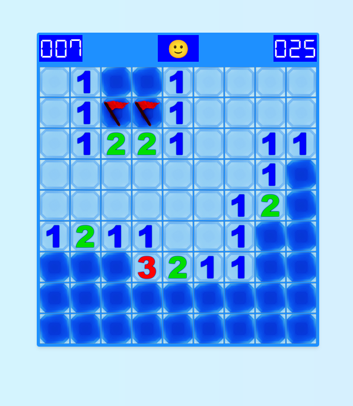

# Minesweeper

This is a browser implementation of the classic game Minesweeper using Angular 16.

## TL;DR

Make sure you have NPM and Yarn installed on your machine, install dependencies with `yarn`. Then, just run `yarn start` to open the project. `yarn test` and `yarn test-coverage` will run the Jest unit tests.

## Technologies used

* Angular 16
* TailwindCSS with SASS
* Redux (NgRx + RxJs)
* Jest (jest-preset-angular)
* Github Actions

## Cool Features

* This project uses SASS for styling (plus TailwindCSS)
* The application can be tested using `yarn test`
* The project auto-lints the files, also, `yarn lint:fix` will try to fix linting problems with Prettier
* A coverage report is available with jest `yarn test-coverage`
* This projects includes load and save features. You can navigate to 'save-and-load' and upload the `saves/savewith35mines.json` file.

## Algorithms employed

This project uses two notable algorithms:

###  Deep Search First

One of the most challenging parts of the game is to implement the following behavior:
>If the clicked cell number of adjacent mines is 0, it behaves as if the user had
clicked on every cell around it.

This is reached by the Deep Search First algorithm
(https://en.wikipedia.org/wiki/Depth-first_search)

### Fisher–Yates shuffle

Another really useful algorithm used in this project is the Fisher–Yates shuffle.
It ensures the creation of truly randomized grids, so each game you generate in this game is unique!
(https://en.wikipedia.org/wiki/Fisher%E2%80%93Yates_shuffle)

## Code coverage

This project aims to have a high unit test coverage for statements.

<pre>-----------------------------------------------------|---------|----------|---------|---------|--------------------
File                                                 | % Stmts | % Branch | % Funcs | % Lines | Uncovered Line #s  
-----------------------------------------------------|---------|----------|---------|---------|--------------------
<b>All files                                           </b> | <b>  94.01</b> | <b>      86</b> | <b>  90.69</b> | <b>  93.81</b> | <b>                  </b> 
<b> app                                                </b> | <b>    100</b> | <b>     100</b> | <b>    100</b> | <b>    100</b> | <b>                  </b> 
<b>  app.component.html                                </b> | <b>    100</b> | <b>     100</b> | <b>    100</b> | <b>    100</b> | <b>                  </b> 
<b>  app.component.ts                                  </b> | <b>    100</b> | <b>     100</b> | <b>    100</b> | <b>    100</b> | <b>                  </b> 
<b> app/features/game/components/main-game             </b> | <b>  93.93</b> | <b>     100</b> | <b>  83.33</b> | <b>  93.93</b> | <b>                  </b> 
<b>  main-game.component.html                          </b> | <b>    100</b> | <b>     100</b> | <b>    100</b> | <b>    100</b> | <b>                  </b> 
<b>  main-game.component.ts                            </b> | <b>  93.75</b> | <b>     100</b> | <b>  83.33</b> | <b>  93.75</b> | <b>59,71             </b> 
<b> app/features/game/containers/board                 </b> | <b>    100</b> | <b>     100</b> | <b>    100</b> | <b>    100</b> | <b>                  </b> 
<b>  board.component.html                              </b> | <b>    100</b> | <b>     100</b> | <b>    100</b> | <b>    100</b> | <b>                  </b> 
<b>  board.component.ts                                </b> | <b>    100</b> | <b>     100</b> | <b>    100</b> | <b>    100</b> | <b>                  </b> 
<b> app/features/game/containers/cell                  </b> | <b>    100</b> | <b>     100</b> | <b>    100</b> | <b>    100</b> | <b>                  </b> 
<b>  cell.component.html                               </b> | <b>    100</b> | <b>     100</b> | <b>    100</b> | <b>    100</b> | <b>                  </b> 
<b>  cell.component.ts                                 </b> | <b>    100</b> | <b>     100</b> | <b>    100</b> | <b>    100</b> | <b>                  </b> 
<b> app/features/game/containers/reset-button          </b> | <b>    100</b> | <b>     100</b> | <b>    100</b> | <b>    100</b> | <b>                  </b> 
<b>  reset-button.component.html                       </b> | <b>    100</b> | <b>     100</b> | <b>    100</b> | <b>    100</b> | <b>                  </b> 
<b>  reset-button.component.ts                         </b> | <b>    100</b> | <b>     100</b> | <b>    100</b> | <b>    100</b> | <b>                  </b> 
<b> app/features/game/containers/seven-segment         </b> | <b>    100</b> | <b>     100</b> | <b>    100</b> | <b>    100</b> | <b>                  </b> 
<b>  seven-segment-display.component.html              </b> | <b>    100</b> | <b>     100</b> | <b>    100</b> | <b>    100</b> | <b>                  </b> 
<b>  seven-segment-display.component.ts                </b> | <b>    100</b> | <b>     100</b> | <b>    100</b> | <b>    100</b> | <b>                  </b> 
<b> app/features/save-and-load/components/save-and-load</b> | <b>  48.14</b> | <b>       0</b> | <b>  57.14</b> | <b>  48.14</b> | <b>                  </b> 
<b>  save-and-load.component.html                      </b> | <b>    100</b> | <b>     100</b> | <b>    100</b> | <b>    100</b> | <b>                  </b> 
<b>  save-and-load.component.ts                        </b> | <b>  46.15</b> | <b>       0</b> | <b>  57.14</b> | <b>  46.15</b> | <b>30-58             </b> 
<b> app/features/settings/components                   </b> | <b>    100</b> | <b>     100</b> | <b>    100</b> | <b>    100</b> | <b>                  </b> 
<b>  settings.component.html                           </b> | <b>    100</b> | <b>     100</b> | <b>    100</b> | <b>    100</b> | <b>                  </b> 
<b>  settings.component.ts                             </b> | <b>    100</b> | <b>     100</b> | <b>    100</b> | <b>    100</b> | <b>                  </b> 
<b> app/features/settings/store                        </b> | <b>    100</b> | <b>     100</b> | <b>    100</b> | <b>    100</b> | <b>                  </b> 
<b>  settings.actions.ts                               </b> | <b>    100</b> | <b>     100</b> | <b>    100</b> | <b>    100</b> | <b>                  </b> 
<b>  settings.reducer.ts                               </b> | <b>    100</b> | <b>     100</b> | <b>    100</b> | <b>    100</b> | <b>                  </b> 
<b>  settings.selectors.ts                             </b> | <b>    100</b> | <b>     100</b> | <b>    100</b> | <b>    100</b> | <b>                  </b> 
<b> app/features/shared/containers/error               </b> | <b>    100</b> | <b>     100</b> | <b>    100</b> | <b>    100</b> | <b>                  </b> 
<b>  error.component.html                              </b> | <b>    100</b> | <b>     100</b> | <b>    100</b> | <b>    100</b> | <b>                  </b> 
<b>  error.component.ts                                </b> | <b>    100</b> | <b>     100</b> | <b>    100</b> | <b>    100</b> | <b>                  </b> 
<b> app/features/shared/containers/header              </b> | <b>    100</b> | <b>     100</b> | <b>    100</b> | <b>    100</b> | <b>                  </b> 
<b>  header.component.html                             </b> | <b>    100</b> | <b>     100</b> | <b>    100</b> | <b>    100</b> | <b>                  </b> 
<b>  header.component.ts                               </b> | <b>    100</b> | <b>     100</b> | <b>    100</b> | <b>    100</b> | <b>                  </b> 
<b> app/features/shared/containers/loader              </b> | <b>    100</b> | <b>     100</b> | <b>    100</b> | <b>    100</b> | <b>                  </b> 
<b>  loader.component.html                             </b> | <b>    100</b> | <b>     100</b> | <b>    100</b> | <b>    100</b> | <b>                  </b> 
<b>  loader.component.ts                               </b> | <b>    100</b> | <b>     100</b> | <b>    100</b> | <b>    100</b> | <b>                  </b> 
<b> app/features/shared/containers/page-wrapper        </b> | <b>    100</b> | <b>     100</b> | <b>    100</b> | <b>    100</b> | <b>                  </b> 
<b>  page-wrapper.component.html                       </b> | <b>    100</b> | <b>     100</b> | <b>    100</b> | <b>    100</b> | <b>                  </b> 
<b>  page-wrapper.component.ts                         </b> | <b>    100</b> | <b>     100</b> | <b>    100</b> | <b>    100</b> | <b>                  </b> 
<b> app/models                                         </b> | <b>    100</b> | <b>     100</b> | <b>    100</b> | <b>    100</b> | <b>                  </b> 
<b>  cell.model.ts                                     </b> | <b>    100</b> | <b>     100</b> | <b>    100</b> | <b>    100</b> | <b>                  </b> 
<b>  gameStatus.model.ts                               </b> | <b>    100</b> | <b>     100</b> | <b>    100</b> | <b>    100</b> | <b>                  </b> 
<b>  level.model.ts                                    </b> | <b>    100</b> | <b>     100</b> | <b>    100</b> | <b>    100</b> | <b>                  </b> 
<b>  sessionTypes.ts                                   </b> | <b>    100</b> | <b>     100</b> | <b>    100</b> | <b>    100</b> | <b>                  </b> 
<b> app/services                                       </b> | <b>  89.38</b> | <b>   84.21</b> | <b>  78.78</b> | <b>  88.99</b> | <b>                  </b> 
<b>  click-handler.service.ts                          </b> | <b>  84.31</b> | <b>   92.85</b> | <b>  72.72</b> | <b>  84.31</b> | <b>32,37,42,59-64,123</b> 
<b>  create-level.service.ts                           </b> | <b>  89.18</b> | <b>       0</b> | <b>     60</b> | <b>  88.23</b> | <b>24,28,32,36       </b> 
<b>  storage.service.ts                                </b> | <b>    100</b> | <b>     100</b> | <b>    100</b> | <b>    100</b> | <b>                  </b> 
<b>  timer.service.ts                                  </b> | <b>    100</b> | <b>      75</b> | <b>    100</b> | <b>    100</b> | <b>45                </b> 
<b> app/state                                          </b> | <b>    100</b> | <b>     100</b> | <b>    100</b> | <b>    100</b> | <b>                  </b> 
<b>  app.actions.ts                                    </b> | <b>    100</b> | <b>     100</b> | <b>    100</b> | <b>    100</b> | <b>                  </b> 
<b>  app.effects.ts                                    </b> | <b>    100</b> | <b>     100</b> | <b>    100</b> | <b>    100</b> | <b>                  </b> 
<b>  app.reducer.ts                                    </b> | <b>    100</b> | <b>     100</b> | <b>    100</b> | <b>    100</b> | <b>                  </b> 
<b>  app.selectors.ts                                  </b> | <b>    100</b> | <b>     100</b> | <b>    100</b> | <b>    100</b> | <b>                  </b> 
<b> app/utils                                          </b> | <b>    100</b> | <b>     100</b> | <b>    100</b> | <b>    100</b> | <b>                  </b> 
<b>  fisher-yates-shuffle.ts                           </b> | <b>    100</b> | <b>     100</b> | <b>    100</b> | <b>    100</b> | <b>                  </b> 
<b>  mock-board.ts                                     </b> | <b>    100</b> | <b>     100</b> | <b>    100</b> | <b>    100</b> | <b>                  </b> 
<b>  mock-cell.ts                                      </b> | <b>    100</b> | <b>     100</b> | <b>    100</b> | <b>    100</b> | <b>                  </b> 
<b>  mock-settings.ts                                  </b> | <b>    100</b> | <b>     100</b> | <b>    100</b> | <b>    100</b> | <b>                  </b> 
<b>  neighbor-offsets.ts                               </b> | <b>    100</b> | <b>     100</b> | <b>    100</b> | <b>    100</b> | <b>                  </b> 
<b>  predefinedLevels.ts                               </b> | <b>    100</b> | <b>     100</b> | <b>    100</b> | <b>    100</b> | <b>                  </b> 
<b>  store-utils.ts                                    </b> | <b>    100</b> | <b>     100</b> | <b>    100</b> | <b>    100</b> | <b>                  </b> 
-----------------------------------------------------|---------|----------|---------|---------|--------------------
</pre>

## Credits

Thanks to eugeneloza that provided the assets here https://opengameart.org/content/minesweeper-tile-set. Also, to the developers behind each of the imported GitHub Actions. This project uses the DSEG7(https://github.com/keshikan/DSEG) font.
